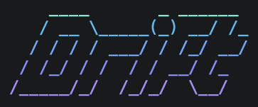

<p align="center">
  
</p>

# Drift

[](https://www.npmjs.com/package/driftdocs)

Detect and maintain the correspondence between specs and code mechanically, instead of
relying on human process.

Drift replaces code⇄spec exploration — "full-text search that re-reads entire documents
on every query" — with indexed lookups over a precomputed graph, structurally reducing
the token usage of AI agents. In steady state all judgments are hash comparisons with
zero LLM calls; an LLM enters only where judgment is genuinely needed (`drift verify`,
and only against stale links).

## Layout

```
packages/core     judgment engine: anchor extraction, hashing, symbol index, lookup,
                  verify, coverage, rename tracking (shared core)
packages/cli      driftdocs (npm) — the `drift` command
packages/mcp      MCP server: drift_context / drift_code / drift_status / drift_diff /
                  drift_approve / drift_suggest / drift_coverage
obsidian-plugin   for non-engineers: status panel with one-click approve + publish button
vscode-extension  for engineers: CodeLens above every linked symbol, inline approve/relink
templates/        GitHub Actions PR bot / git hook
docs/design.md    drift's own spec — maintained with drift itself (see Dogfooding)
```

## Symbol backends

Drift needs a symbol index (where is each function/class, what are its lines). Two
backends implement the same interface — choose per-repo with `backend` in
`.drift/config.json`:

- **`builtin`** — drift's own tree-sitter indexer (WASM grammars: TypeScript,
  JavaScript, Python, Go, Rust, Java, Ruby). Zero external dependencies, and hash
  normalization is AST-accurate: comment nodes are stripped from the parse tree, so a
  `//` inside a string literal can never corrupt a hash.
- **`codegraph`** — reuse an existing [CodeGraph](https://www.npmjs.com/package/@colbymchenry/codegraph)
  index (`.codegraph/codegraph.db`) read-only.

If the config names `codegraph` but no index exists (e.g. in CI), commands fall back to
`builtin` with a notice. Links approved under one backend evaluate correctly under the
other.

## Data model

- **SpecAnchor** — a section derived automatically from a markdown heading
  (`docs/auth.md#token-refresh`). Section bodies are cached, so context queries never
  re-read documents. When a heading is ambiguous, override the slug with a
  `drift-anchor` comment placed immediately above the heading.
- **Link** — a many-to-many edge between a symbol and an anchor. Pins the hash of both
  sides at approval time (code is normalized to ignore formatting noise).
- **Status** — `fresh` (neither side changed) / `stale` (either side was edited) /
  `broken` (either side disappeared — with rename detection, see below).

## Usage

```sh
npm i -D driftdocs    # installs bin name `drift`
npx drift init        # choose backend, agents, strategies
npx drift index       # extract anchors from docs/
npx drift sync        # apply @spec: annotations + .drift/links.json
                      #   (scans tracked AND untracked non-ignored files)
npx drift suggest     # propose links by matching symbol names against spec text
npx drift status      # fresh/stale/broken for every link (--check: fail CI on non-fresh)
npx drift verify      # LLM-judge whether STALE links still agree (see below)
npx drift coverage    # % of symbols with spec links, by kind
npx drift context AuthService::refreshToken   # code → spec (hierarchical fallback)
npx drift code docs/auth.md#login-flow        # spec → code
npx drift file-links src/auth.ts              # links in one code file (editor view)
npx drift approve 3   # re-approve a stale link as "still correct"
npx drift relink 3    # re-point a broken link at a renamed symbol
npx drift mcp         # start the MCP server (stdio)
```

Links are declared with a code-side annotation (`@spec:` + anchor id in a comment
directly above the symbol):

```ts
// @spec: docs/auth.md#login-flow
async login(user: string, password: string): Promise<string> {
```

The annotation binds to the nearest *linkable* symbol below it (function, class,
method, …). If it would bind to something else — a type alias or a constant — or sits
suspiciously far from its symbol, `drift sync` warns instead of silently creating a
wrong link. Non-invasive alternative: `.drift/links.json` with
`[{ "symbol": "AuthService::login", "spec": "docs/auth.md#login-flow" }]`.

### Rename tracking

A pure rename no longer strands links as permanently broken. When a linked symbol
vanishes, drift searches for a symbol whose current source hashes to the approved
hash (verbatim, or after substituting the new name back to the old one):

```
✗ [3] BROKEN (symbol missing)  login ↔ docs/auth.md#login-flow
    ↳ moved? source now matches 'authenticate' (src/auth.ts) — drift relink 3
```

`drift relink 3` re-points the link and keeps the anchor pin and origin.

### Semantic verification (drift verify)

Hash comparison says "something changed"; `drift verify` asks Claude whether the
current code still satisfies the current spec text — only for stale links, so
steady-state cost stays zero and spend scales with the size of the change.

```sh
npx drift verify --diff origin/main    # verify only links touched by this branch
npx drift verify --auto-approve        # re-pin links judged still consistent
```

Verdicts are `consistent`, `diverged` (quotes the contradicted spec sentence verbatim),
or `uncertain` (needs a human). Requires Anthropic credentials (`ANTHROPIC_API_KEY` or
`ant auth login`); the model is configurable via `verify.model` in the config.

### Bootstrapping an existing codebase

```sh
npx drift suggest             # candidates from deterministic lexical matching
npx drift suggest --min-high  # only code-span / heading matches
npx drift suggest --apply     # create all candidates (origin: ai-suggested)
npx drift coverage            # measure progress
```

## Editor integrations

**VS Code** (`vscode-extension/`): a CodeLens above every linked symbol —
`spec: ✓ fresh docs/auth.md#login-flow` — click to open the spec section; stale links
get an inline **Approve**, broken links with a rename candidate get **Relink**. Build
with `npm run build` in `vscode-extension/`, then package with `npm run package`.

**Obsidian** (`obsidian-plugin/`): for spec authors — per-section link status with
badges, one-click approve/unlink, and a Publish (commit & push) button.

## PR bot

Copy `templates/drift-pr-bot.yml` into `.github/workflows/`: each PR gets a comment
evaluating only the links touched by its changed files. With the builtin backend no
extra indexing step is needed in CI.

## Dogfooding

This repo runs drift on itself: `docs/design.md` records the design decisions, each
section is linked to its implementation via `@spec:` annotations, and CI
(`.github/workflows/drift.yml`) fails if any link is stale or broken. Try it here:

```sh
npm install && npm run build
node packages/cli/dist/main.js status
node packages/cli/dist/main.js context DriftEngine::evaluateLink
```

Dogfooding has already paid for itself: it caught a tree-sitter lexer trap corrupting
the parse of `anchors.ts`, and a slug-hijacking bug in explicit anchor overrides —
both found because drift's own links went bad.

## Design notes

- Detection is hash comparison only; LLMs enter only at explicit verification
- Lookup is an O(edge-degree) index read; containment fallback returns `inferred: true`
- Specs live in git-managed markdown (Obsidian-compatible); publishing is an explicit act
- Links accrue incrementally: PR-touched spots + `drift suggest`, never a forced batch
- `.drift/config.json` is validated on every command; `docsDir: "."` is rejected outright

## Development

```sh
npm install
npm run build     # core → mcp → cli (order matters: cli bundles core)
npm test          # unit tests (packages/core)
```
